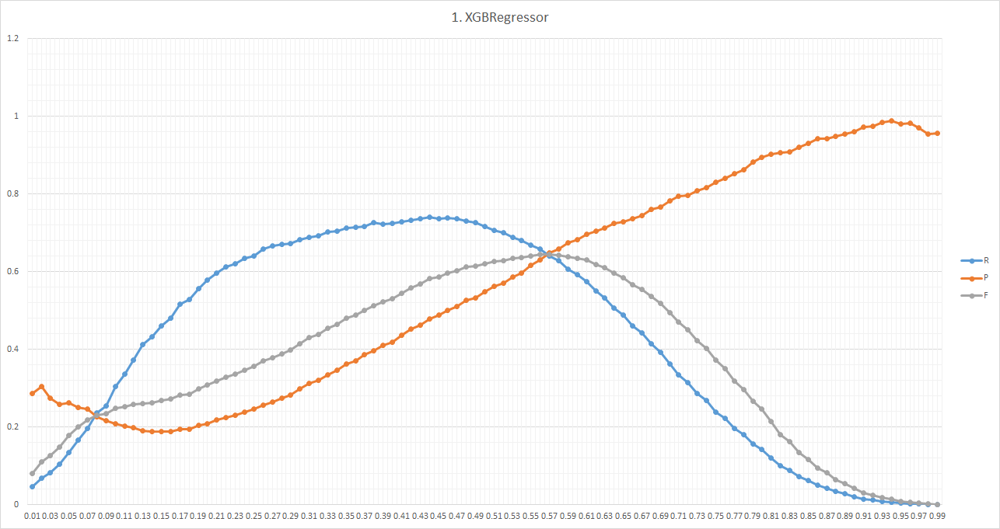
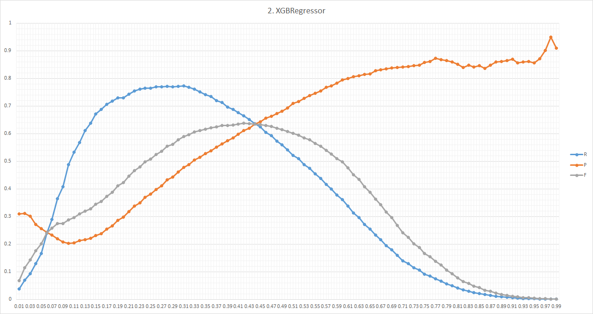

## Overview

| Index | Date       | bestT | bestR    | bestP    | bestF    | R_max    | P_max    | F_max    | Area_PR  |
|-------|------------|-------|----------|----------|----------|----------|----------|----------|----------|
| 1     | 2015/06/02 | 0.57  | 0.641265 | 0.648288 | 0.644757 | 0.675249 | 0.664943 | 0.670056 | 0.423171 |
| 2     | 2015/06/09 | 0.42  | 0.664828 | 0.612189 | 0.637424 | 0.698683 | 0.628423 | 0.661693 | 0.49634  |

## Model Descriptions and Charts
### 1. XGBRegressor (2015/06/02)
`XGBRegressor(max_depth=10, nthread=12)` trained on first 100 images using VGG CNN F.

### 2. XGBRegressor
`XGBRegressor(max_depth=10, nthread=12, min_child_weight=2)` trained on first 50 images using VGG CNN F with Poisson-disk sampling with radius 2.

